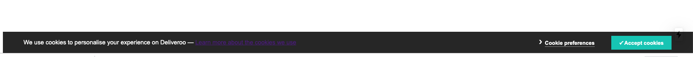
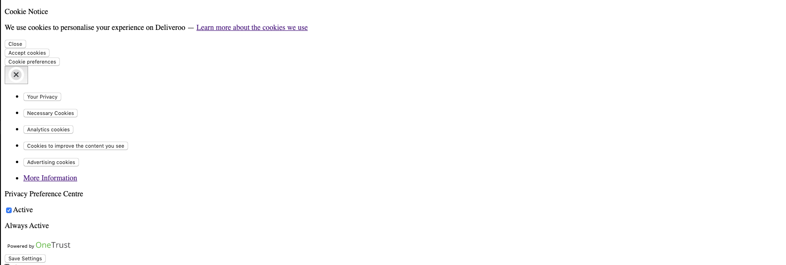

# Next.js script problem

## Describe the bug

We are displaying a banner for users to manage their third party cookie consent. We include the script on the page
and then it goes and downloads the necessary styling.

When upgrading from version `9.0.2` to `> 9.0.3` we are seeing an issue with the script inclusion.

The script seems to be rendered in the page source (`View Page Source`), but when looking at the Elements tab of the
devtools it's not visible. When going to the network tab, we can see the script being downloaded successfully.

We can also see the CSS the script dynamically loads in the network tab, but it doesn't appear on the page.

## To Reproduce

Steps to reproduce the behavior, please provide code snippets or a repository:

1. Use [test repo][test-repo] and run `yarn dev`
2. Load main page, view designs (actual behaviour)
3. Downgrade next to v`9.0.2`, `npm install`, `yarn dev`
4. Load main page, view designs (expected behaviour)

## Expected behavior

## Actual behaviour

## Screenshots

See above

## System information

- OS: macOS
- Browser (if applies): Chrome, Firefox
- Version of Next.js: 9.0.7 (breaking at 9.0.3)
